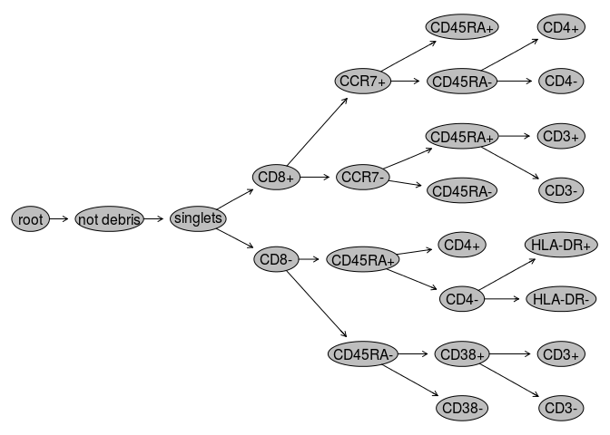
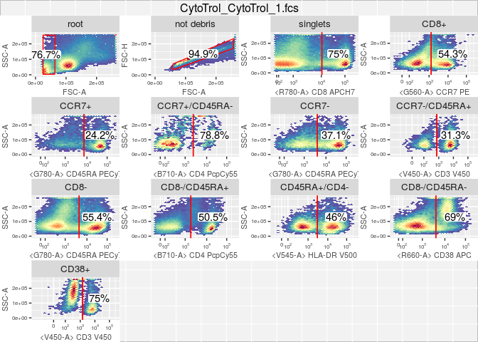

# cytoEx: Exhaustive autogating for openCyto
Mike Jiang  
September 27, 2016  

This package fully automates the `openCyto` gating without the need of prior knowledge about the gating hierarhcy.
It creates the gating tree automatically by selecting the best marker/parameter at each level.


```r
library(openCyto)
library(cytoEx)
```

## Load existing gating set

```r
dataDir <- system.file("extdata",package="flowWorkspaceData")
gs <- load_gs(list.files(dataDir, pattern = "gs_manual",full = TRUE))
```

## create a copy of gs

```r
gs2 <- clone(gs, isNew = FALSE, isEmpty = FALSE)
```

## Start from singlets node

```r
for(node in getChildren(gs2, "singlets"))
  Rm(node, gs2)
```

## Run the exhaustive gating using `openCyto::mindensity`

```r
gating("singlets", gs2, gating.function = mindensity)
```

## plot the results

```r
plot(gs2)
```

<!-- -->

```r
library(ggcyto)
autoplot(gs2[[1]])
```

<!-- -->

## Inspect the gating tree interactively by shinyCyto

```r
shinyCyto::gatingTreeApp(gs2)
```

